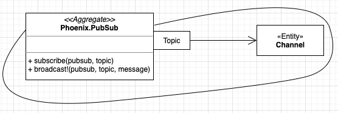
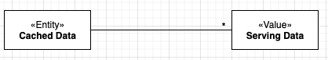
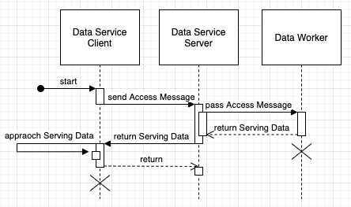
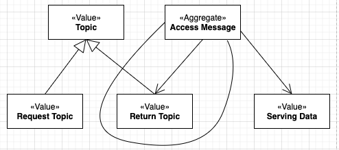
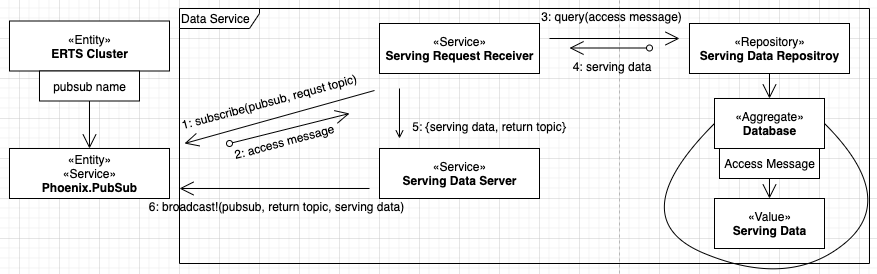
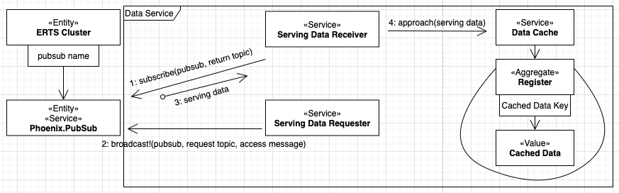

# Data Service

一個 Phoenix.PubSub 是個 aggregate ；可藉由 topic 取得對應的 entity Channel 。

我要做一組分散式程式：假設主題為 Data Service ，系統分為服務端與客戶端二份，二端分別在各自的節點上執行。

服務端負責提供資料，模式定為 value object —— Serving Data 。客戶端索取 Serving Data 並處理為 Cached Data 。

我會用一個稱為 Access Message 的查詢條件，每次查詢，先取得一段 Serving Data ，接著處理它，使它加入 Cached Data 。

資料快取處理，開始由資料服務客戶端向服務端發送 Access Message 。資料服務的服務端回覆 Serving Data 。最後，前者消化 Serving Data ，將之收斂到 Cached Data 裡。

Access Message 是 entity ，其中可找出一個 Return Topic 。

Return Topic 表示資料服務客戶端打算由指定的 Return Topic 通道收到 Serving Data ，做為回覆訊息。

相對有個 Request Topic ，表示資料服務的服務端先在指定的 Request Topic 通道等候 Access Message ，做為請求訊息。

每個 Access Message 有對應的 Serving Data 。

Request Topic 與 Return Topic 都是 value object ，因為可共享使用。但只有 Return Topic 附著在 aggregate Access Message 裡；那是為了能自然地使用請求訊息，並且知道那一則請求訊息的回覆地址。

資料服務的服務端模式
由整個 ERTS 網路，即由一個或多個 ERTS 個體所構成的系統，可以藉由 pubsub name 找到個別 Phoenix.PubSub 。

Phoenix.PubSub 是 service 且是 aggregate 。

服務端程式有 Serving Request Receiver ， Serving Data Server 與 Serving Data Repository ，共同接收 Access Message ，並回應 Serving Data 。

最先， Serving Request Receiver 訂閱 Phoenix.PubSub 的 Request Topic 通道（見 1: ）。在不確定多久之後，由該通道送來了 Access Message （見 2: ），而啟動了資料查詢 （見 3: ） 。查詢結果是個 Serving Data （見 4: ）。 Access Message 內容包含 Return Topic （見 5: ）。 Serving Data Server 向 Phoenix.PubSub 的 Return Topic 通道發送 Serving Data （見 6: ），而結束一次查詢。

在系統準備階段，先進行圖示步驟 1: 。接著，每一次查詢，依序進行步驟 2:, 3:, 4:, 5:, 6: 等。

資料服務客戶端模式
客戶端也是，由整個 ERTS 網路（由一個或多個 ERTS 個體所構成的系統）藉由 pubsub name 找到個別的 Phoenix.PubSub 。

客戶端程式由 Serving Data Receiver ， Serving Data Requester 與 Data Cache 組成。

Serving Data Receiver 先訂閱 Phoenix.PubSub 的 Return Topic 通道（見 1: ）。之後，在需要載入快取資料時，由 Serving Data Requester 向 Phoenix.PubSub 的 Request Topic 通道發送 Access Message （見 2: ）；在那之後的流程，即服務端模式的步驟 2:, 3:, 4:, 5:, 6: 等，最後讓客戶端收到 Serving Data （見 3: ）。收到的 Serving Data 轉送給 Data Cache 而匯入裡頭的 Registry 。
